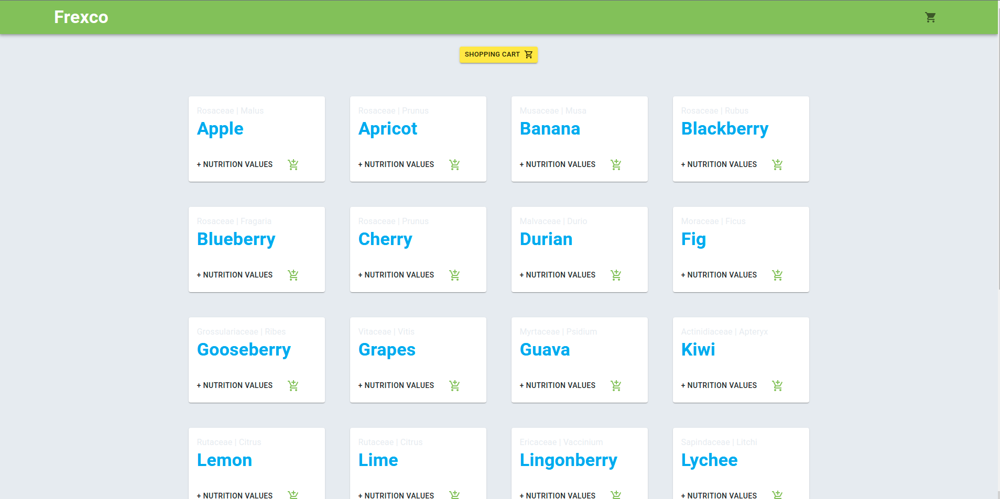

# Projeto para o processo seletivo @Frexco

1. [Desafio](#desafio)
2. [Resolução](#resolução)

## Desafio:

Nesse desafio, o objetivo era construir uma aplicação web utilizando uma API pública escolhida especialmente para mim, a [Fruityvice](https://www.fruityvice.com/doc/index.html).

Foi me pedido utilizar <b>React.js</b> e <b>JavaScript</b> para criar:

<ul>
<li>Uma página de listagem de produtos </li>
<li>Uma página de carrinho de compras </li>
<li>Mostrar, de alguma forma, as informações nutricionais dos produtos. </li>
<li>Utilizar states do React para lógica da página</li>
</ul>

### [Link do projeto LIVE @Netlify](https://frexco-challenge.netlify.app/)

## Resolução

Utilizei Hooks e o ContextAPI do <b>React</b> para controlar o state do carrinho e dos produtos.

A API apresentou erros de acesso em cross-site e por isso criei um proxy com [cors-anywhere](https://github.com/Rob--W/cors-anywhere) e chamei a API através desse proxy.

Não utilizei TypeScript porque é uma tecnologia que ainda não domino 100% e com o prazo de 5 dias de execução, achei melhor não complicar as coisas para ter certeza da entrega.

Utilizei o <b> react-router-dom </b> para as rotas personalizadas, o <b> Material-UI </b> para facilitar o layout das informações e <b> react-toastify </b> para fornecer respostas às ações dos usuários (também conehcidas como flash messages), melhorando a experiência.

Esse desafio foi uma grande experiência e serviu como um ótimo aprendizado. Principalmente em relação aos problemas que tive com o CORS, a utilização do <b> react-toastify</b> e <b> Material-UI, </b> que até então nunca havia utilizado em um projeto React.
